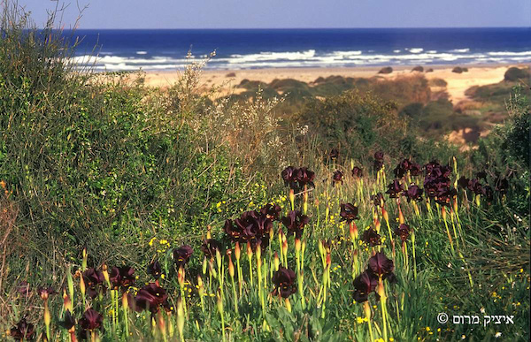

Enketo is helping a team of volunteers with ecological surveys of open spaces on reserves in Israel. 

The implementation happened due to prior experience of one of the volunteers, Noam Rozenfeld, with Enketo at his job with the Survey of Israel, a government-run national mapping office. There, Enketo was used with formhub to perform quality checks on information contractors updated nationwide. The free and easy to use creation and implementation of Enketo, compared to ARC Collector, was better suited to this situation. 

The group of Netanya volunteers goes to the open areas in their city and catalogs the various plant and animal life. A unique feature of the reserve is the presence of the [coastal iris (Iris atropurpurea)](http://www.flowersinisrael.com/Irisatropurpurea_page.htm), a worldwide critically endangered plant only present in Israel. The reserve contains the largest population in the world, and it is being monitored using Enketo. The survey in Enketo, also used in ODK for better location accuracy issues, also allows them to report problems or maintenance that needs to be done. Invasive plant species have been identified so they can be eradicated. For the first time in four years, mountain gazelle have returned to the reserve. The data that is collected by Noam and other volunteers is used to help educate the public through signposts and information pages. Ultimately, Enketo should be used across the city by all its citizens as a way to inform, acknowledge, report and collect disturbances and nature related issues in all of the nature reserves which would allow for better analysis.  More importantly, the citizens will feel more connected to their surroundings. 
