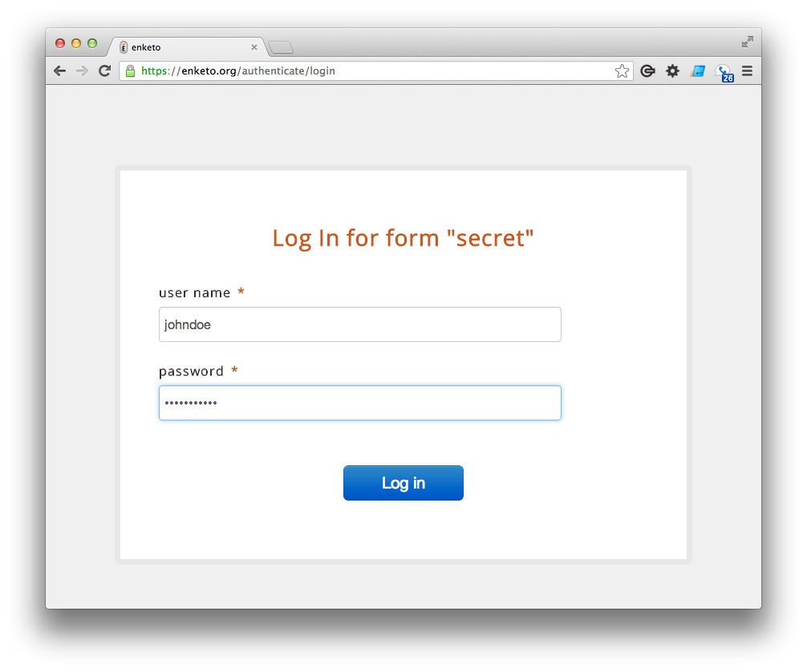

After completing the final two major "must have" features, i.e. __form authentication__ and __calculations inside repeats__, a new phase has arrived for Enketo. There are still many exciting new features in the pipeline, but these fall mostly in the "nice to have" category and are therefore less of a priority. In this new phase the focus will shift towards _stabilizing_, _improving_, and _fixing_ existing features.

Some of the planned work will make it easier for developers to maintain and to contribute to the Enketo source code. In addition Enketo will become more robust, faster and just even better in every aspect. The pace of this work will depend on the requirement of the sponsor(s) and contributors but it is expected to continue steadily.

Work on [enketo.org](https://enketo.org) will get a high priority in July. If your organisation would already like to start using enketo.org, to help test the service, please let me know. I would be happy to manually add support for your Aggregate or Formhub server for the period until launch.

More about the plans for [enketo.org](enketo.org) soon!
