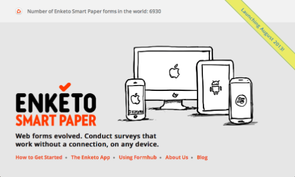
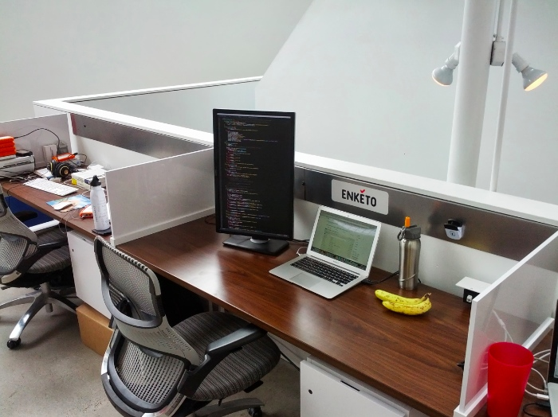

As discussed in various [previous posts](../approaching-stability-phase/), the [formhub user forum](https://groups.google.com/forum/#!searchin/formhub-users/enketo) and in the [Enketo presentation at Humanitarian Nomad](../nomad-presention-2013/), my goal is to make Enketo a sustainable project and further increase its adoption. Enketo needs to be able to continuously improve and scale relatively independently. To achieve this, the first requirement is a _stable source of revenue_.

### Strategy

Enketo LLC's strategy consists of:

* provide [enketo.org](https://enketo.org) as a paid service where any organization that uses its own installation of [ODK Aggregate](http://opendatakit.org/use/aggregate/) or [Formhub](https://github.com/modilabs/formhub) can use Enketo for data collection in a manner that is __affordable__, __secure__, __robust__, easily __integratable__, and uses the organization's __own branding__. 
* maintaining and improving capacity to conduct paid development work on Enketo for __multiple clients__ (in addition to the amazing [Sustainable Engineering Lab](http://modi.mech.columbia.edu/)). 
* encourage significant contributions by others to the Enketo source code

I think that if 2 out of 3 of these are successful, the prospects for sustainability look good. 

### Milestones

The next milestones in the implementation of this strategy are:

1. launch [enketo.org](https://enketo.org) (end of August)
2. sign web development contracts with new customers for new features or improvements (discussions are pending)
3. form a partnership with another developer and/or a designer to increase capacity and share responsibility (so far only consultants are attached)
4. get major pull requests from third party developers

### Environment

With its recent move to <a href="http://galvanize.it">Galvanize</a>, a very cool co-working space in Denver, Enketo LLC has found the perfect working environment to implement these exciting plans. It is now surrounded by other Internet Businesses (some are even hipper than Enketo). The vibe and networking opportunities here are awesome and will be a great positive influence on the work!

### Becoming social
When time allows, we need to start hitting the social networks. If you'd like to __really__ help with this you could start following Enketo on [twitter](https://twitter.com/enketo), on [Google+](https://plus.google.com/111302551985955001010/) and on [LinkedIn](http://www.linkedin.com/company/enketo-llc).

I will report back on the progress in meeting these milestones!
