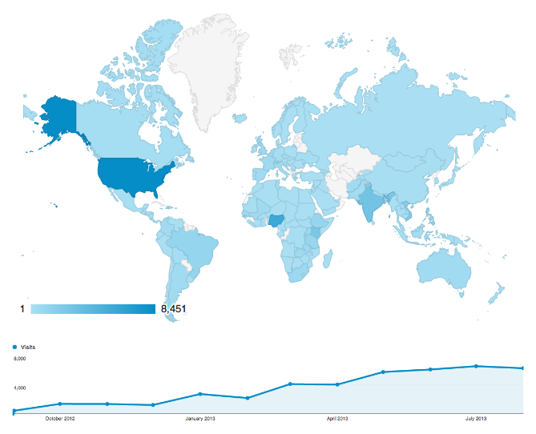

Enketo.org has launched! If you are using ODK Aggregate or have installed Formhub yourself, you now finally have a convenient and affordable option to start using Enketo Smart Paper for your data collection. 

Enketo Smart Paper has proven to be a very popular tool for data collection within formhub.org where it has been used for exactly one year today. It has been used in humanitarian aid, development work, election monitoring, and research by UN agencies, governmental- and non-governmental organizations, and universities.

It has continuously improved over this period and enjoyed a nice steady growth of users all around the world. Now with this brand new service Enketo Smart Paper is available to ODK Aggregate users and organizations that use their own installation of Formhub.

### How to start using the service?

1. If you're not already familiar with [Aggregate](http://opendatakit.org/use/aggregate/), or [Formhub](https://formhub.org/resources/) start learning about these platforms first. This [overview](https://enketo.org/openrosa) may be helpful.
2. Make sure you have an installation of ODK Aggregate or Formhub at your disposal.
3. Sign up for an enketo.org [account](https://accounts.enketo.org) (your first 30 days will be FREE).
4. Login to your Enketo account and pick a plan. 
5. Enter your ODK Aggregate or Formhub server address in your Enketo account.
6. Either use [enketo.org/forms](https://enketo.org/forms), your installation of Formhub or integrate enketo with your installation of ODK Aggregate using the awesome [Enketo API](http://apidocs.enketo.org) and the API token you'll find in your account.
7. Start collecting data!

### Can I still use ODK Collect?

Absolutely! The two tools complement each other very well. You can use enketo in conjunction with ODK Collect for the same survey or decide on a survey-to-survey basis which tool is the best for you. The table on [this page](https://enketo.org/openrosa) may help explain the key differences.

### Thanks

A lot of the credit for making Enketo Smart Paper the great tool it is goes to the [Sustainable Engineering Lab](http://modi.mech.columbia.edu/) at Columbia University and all the colleagues with whom I have been working for the past 12 months. For setting up this service, I especially want to thank the people that helped out by discussing, designing, editing, installing and/or coding: Matt Berg, Roger Wong, Alex Dorey, Ukang'a Dickson, Myf Ma, Prabhas Pokharel, and Beth Martin.
