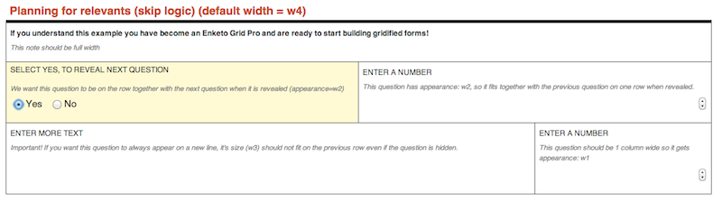

Some happy end-of-year Enketo news!

#### A brand new theme

The [Santa Fe Institute](http://www.santafe.edu/) (SFI) has contracted us to develop a new theme for Enketo Smart Paper that displays forms inside a flexible grid. For now we're calling it the _Grid Theme_. This theme will emphasize print-friendliness and allow form designers a large amount of flexibility in determining how forms are laid out, i.e. whether questions should be placed next to each other or below each other. This project is part of a [collaboration](http://www.santafe.edu/news/item/gates-slums-announce/) between the Santa Fe Institute and [Shack/Slum Dwellers International](http://www.sdinet.org/) through a grant by the [Bill & Melinda Gates Foundation](http://www.gatesfoundation.org/). It will officially launch some time in the Spring, but if you would like to test an early version, let me know!

#### WHO-Ona sponsorship

The [World Health Organization](http://www.who.int/en/) (WHO) is sponsoring the development of a number of improvements and new features of Enketo Smart Paper. This is being done through an agreement with a hot new startup called Ona (of which I think we will soon hear a lot more!). I will describe the WHO-sponsored projects in detail in future posts. The first (and sexiest) is expected to launch in early January.

#### A partnership with SDRC

Enketo has also formed a partnership with [Siddha Development Research and Consultancy](http://sdrc.co.in/) (SDRC) in Odisha, India. SDRC enables their partners to design and manage social change initiatives that deliver high impact results. SDRC has been flexing their coding muscles to start integrating Enketo into ODK Aggregate, using this [Enketo API](http://apidocs.enketo.org), and has plans to further promote and adopt Enketo Smart Paper in their projects.

#### Solidifying support in 2014

There has never been a lack of enthusiasm for Enketo, and it is encouraging to now see organizations follow [SEL](http://modi.mech.columbia.edu/)'s lead and step in to actually support it and push it forward. My hope is that more sponsorship agreements will follow in 2014 and that some of these will become long-term.

Several other organizations have expressed an interest in supporting the [open-source Enketo libraries](https://github.com/MartijnR?tab=repositories), in particular [enketo-core](https://github.com/MartijnR/enketo-core). The latter is currently being used by a number of groups to develop Android applications, and I'm hopeful that those groups will eventually contribute back to the project in some manner.

For those interested in following the example set by SEL, SFI, WHO, and SDRC, see e.g. [this list](https://github.com/MartijnR/enketo-core/issues?state=open) of desired and mostly unfunded features and improvements to Enketo Smart Paper.
