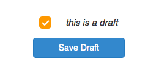
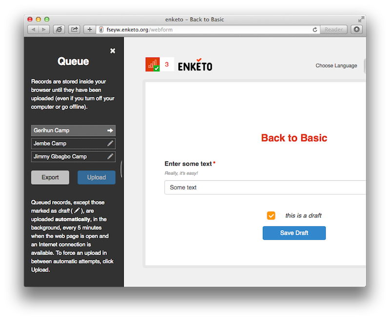

In a [previous post](http://blog.enketo.org/sponsorships-2013/), I highlighted the investment of the [World Health Organization](http://www.who.int/) (WHO) is making in improving Enketo. One of the more visible results of this funding is the ability to save records as a draft to continue them at a later time. This feature is now available for use on enketo.org and formhub.org! 

Enketo Smart Paper was built from the ground up to be _offline-capable_, i.e. to be able to launch offline and to save records persistently in the browser until some time in the future when a connection is available and they can be uploaded to the server. This means that saving records as a draft was technically feasible using the existing architecture.

We tried to make the feature as straightforward as possible. The default has remained unchanged, but you will now see right above the submit button an option to mark a record as draft. Draft records will __never__ be submitted to the server and are easily recognizable in the sidebar (with a little pencil icon). To load a draft record in order to continue data entry, simply click on it. 

To make it easy to find a draft record later, you have the option to give it a name. This name exists locally in the browser storage only and will not be transferred back to the server.

To keep the feature safe, robust, affordable and free of fluff, final records cannot be loaded/edited/updated. As soon as a record is saved without marking it as a 'draft', it is considered cleared for uploading to the server as soon as a connection is available. Enketo will attempt to upload it immediately.

This is just one of a list of improvements sponsored by WHO in January and February. More to follow soon! 

Let us know what you think and please tell us if you discover any rough edges or bugs!
