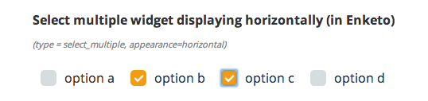

As mentioned in a [previous post](http://blog.enketo.org/sponsorships-2013/), the [Santa Fe Institute](http://www.santafe.edu/), [Gates Foundation](http://www.gatesfoundation.org/) & [Shack/Slum Dwellers International](http://www.sdinet.org/) are sponsoring a significant effort to create a new flexible grid theme for Enketo Smart Paper. 

Though the new theme will not be finished for another few months, a tiny component of this work is now available in the current _Formhub theme_! You can now display choice lists (select multiple and select one) horizontally simply by applying the appearance 'horizontal' in your XLS Form (or XForm).

Sometimes, it's the little things that matter!


