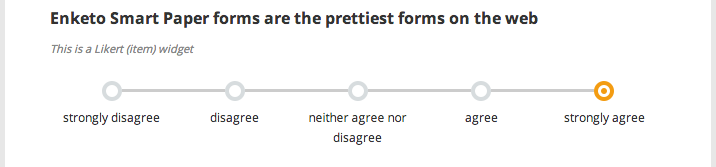

Enketo Smart Paper now includes a __Likert widget__ to enable the use of [Likert scales](http://en.wikipedia.org/wiki/Likert_scale) in surveys.

To use a Likert widget just add appearance _"likert"_ to any _"select-one"_ question. See this [demo webform](https://likert.enketo.org/webform) and this [form source](https://docs.google.com/spreadsheet/ccc?key=0Al3Mw5sknZoPdEpCZ2NtLVdXeC1UeGg2LTctRW9wX3c&usp=sharing) to learn more.

To facilitate the easy calculation of a Likert scale (by adding up the values of Likert items), you'll probably want to make sure you use _numeric values_ in those choice lists. You can perform the calculation either in the form itself (as done in the demo) or in your analysis.

This brand new feature was sponsored by [WHO](http://who.int) through Ona.  

Happy Likert scaling!


