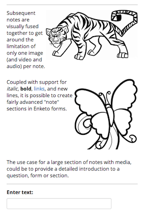

Enketo now offers a better way to designing sections of text and media (aka "notes" in XLSForm or readonly inputs in XForm). [This Form](https://notes.enketo.org/webform) shows what you can now create.

### Combine multiple notes visually
The form format only allows one of each type of media (image, video, audio) to be added to a note. To work around this limitation, subsequent notes will now be visually merged together so that they appear as one note.

### Format text
This is on old feature, but it was never properly introduced. Enketo has support for a limited subset of Markdown and line breaks. You can format text in the following ways:

* _emphasize words_ by wrapping them inside \_these\_ or \*these characters\*
* __strongly emphasize words__ by wrapping them inside \_\_these characters\_\_ or \*\*these\*\*
* [a link](https://enketo.org) can be added by using \[a link\]\(https://enketo.org\) 
* in XLSForm add a line break where you want it with Ctrl-Enter (may be different key combination for some spreadsheet software)

### ODK Collect
At the moment these features degrade gracefully in ODK Collect, so you will not loose compatibility. It will just show the markdown characters.


