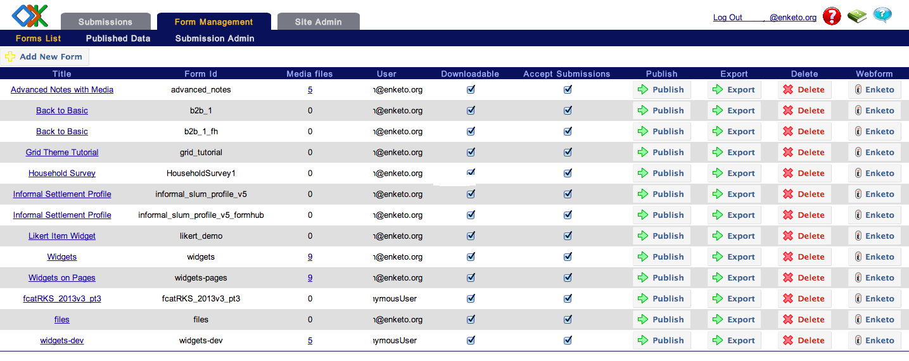

I am pleased to announce that Enketo.org is now integrated with ODK Aggregate. From [Aggregate v1.4.1](https://code.google.com/p/opendatakit/wiki/AggregateReleaseNotes) onwards, there is now a much easier way for ODK Aggregate users to launch forms in Enketo for data collection. It now requires just the click of a button in Aggregate!

If you are hosting an installation of Aggregate 1.4.1 and want to enable this feature all you need is an [Enketo.org account](https://accounts.enketo.org). A [free plan option has just become available](/plan-prices-reduced/). When you have an account, you'll just have configure 2 settings in ODK Aggregate to **link** it with Enketo. The Enketo buttons in Aggregate will magically appear once you have linked it.

To read the instructions in more detail, visit [this page](https://accounts.enketo.org/support/aggregate/).

Many thanks to [SDRC](http://sdrc.co.in) for developing this feature and thanks to Mitch and the rest of the [ODK](http://opendatakit.org/) team for their advice and for welcoming SDRC's code contribution. I have no doubt the new addition will be well-received by ODK users, and will open the road for deeper integration in the future. The next key integration features could for example  be to:

* use enketo's [edit API](http://apidocs.enketo.org/#/post-instance) to open an __existing already-submitted record for editing__ in Enketo. This functionality is already used in formhub.org and utilizes an elegant mechanism in the OpenRosa specification that ODK, Formhub and Enketo are built around.
* build automatic __quota management__ into Aggregate by sending a [de-activation request](http://apidocs.enketo.org/#/delete-survey) to Enketo when a form has been deleted from Aggregate.

