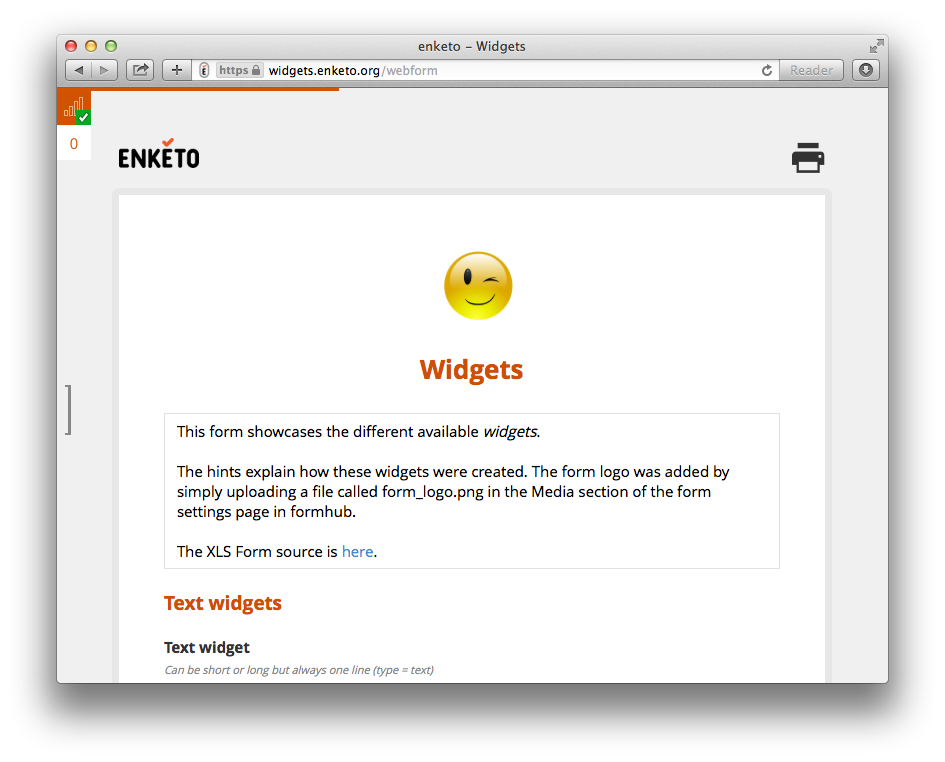

You may have noticed that Enketo now has a progress bar fixed to the top of the screen. 

The bar indicates the current position in the form. This means when you reach question 30 out of 90, it will show as 30% full. 

This feature was developed for the [HRP](http://www.who.int/reproductivehealth/topics/mhealth/en/) project under a contract with [WHO](http://who.int). 
