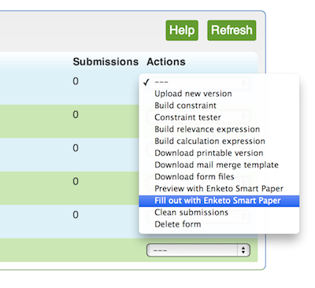

Following into the footsteps of [ODK](http://opendatakit.org/2014/02/odk-aggregate-1-4-1-with-enketo-webforms-integration-is-now-available/), another great service called [SurveyCTO](https://www.surveycto.com) has integrated with Enketo.org.

From [SurveyCTO v.1.20](https://www.surveycto.com/support/release-notes.html) onwards, there is now an easy way for SurveyCTO users to launch forms in Enketo for data collection. Users can simply select the option from the pulldown list.

To enable the feature, SurveyCTO users that have upgraded to v1.20 can sign up for an [Enketo.org account](https://accounts.enketo.org). A [free plan option is now available](/plan-prices-reduced/). Once you have an enketo.org account, you'll have configure 2 settings in SurveyCTO to **link** it with Enketo. The Enketo options in SurveyCTO will magically appear once you have linked it.

To read the instructions in more detail, visit [this page](https://accounts.enketo.org/support/surveycto/).

Many thanks to Chris and his team at SurveyCTO for developing this feature and for pushing me to add some missing features to enketo that SurveyCTO users utilize.

Welcome to all SurveyCTO users!
