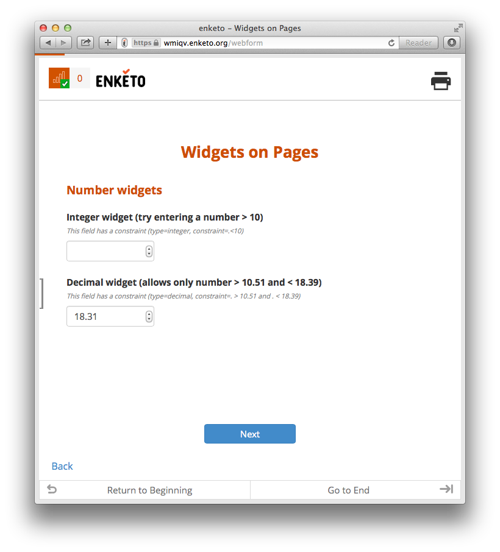
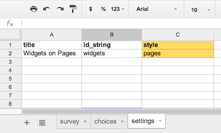

Sometimes it is better to separate a form into multiple pages (like ODK Collect does by default). This is now possible in Enketo!

### How to activate

The _default_ view will continue to show the _whole form_ on one page, but if you'd prefer to show your form in pages mode, simply add style _'pages'_ on the settings tab of your XLSForm. This requires the latest version of XLSForm (already deployed on formhub and Ona, [edit May 6th 2014] and now also on opendatakit.org). Alternatively, XML warriors can also edit the XML Form by hand by adding _class="pages"_ to the <h:body\> element. SurveyCTO users have built-in support for this from version 1.211 onwards (you need to contact them to request the upgrade to this version). Users of older versions of SurveyCTO can also just upload the XML Form that they generate on e.g. [opendatakit.org](http://opendatakit.org/use/xlsform/).

### How it works

Only top-level groups (or XLSForm repeats which are wrapped inside a group automatically) can be displayed on a separate page by adding appearance _'field-list'_. It works the same in ODK Collect.

### How to plan for this

If you'd like to separate a form into more than 1 page, it is best practice to start designing your form by creating all the groups (or repeats) you would like to separate. It is recommended to not place any questions outside these groups (though Enketo has some built-in tolerance for this).

### How this works with skip-logic (relevants)

If a top-level group (or repeat) has both appearance=field-list and a relevant condition, the page will only be shown to the user if the condition is met. 

### How to navigate between pages

Use the back link and next button to navigate between pages. On a device with a touch screen (or a trackpad) and an advanced browser, you can also swipe between pages. 

### Acknowledgement

This feature was developed by Ona and Enketo LLC for the [HRP](http://www.who.int/reproductivehealth/topics/mhealth/en/) project under a contract with [WHO](http://who.int). 


