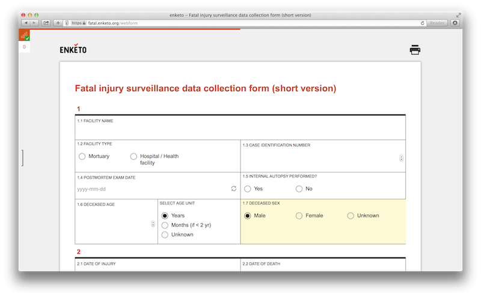
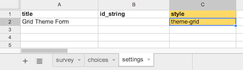
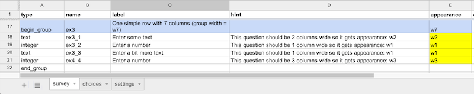

Enketo Smart Paper now has a brand new theme option: __The Grid Theme__. Click the screenshot below to check out a sample form right away.

This sample form was developed by Ona for [WHO](http://who.int). 

### Focus on larger screens and printing

Similar to the current default theme, the new Grid Theme is fully functional on mobile devices. However, the Grid Theme is primarily meant for use on larger screens. The larger screen real estate is required to display questions next to each other. The Grid Theme was also designed to create good-looking and compact printouts. 

### How to use

This theme is ~~currently exclusively available to [enketo.org](https://enketo.org) users~~ available for everybody. To use it add the value _'theme-grid'_ on the settings tab of your XLSForm in the 'style' column. This will switch your form to the Grid Theme. If you have multiple settings for 'style' (e.g. ['pages'](/pages) and 'theme-grid') simply separate them with a space. 

To fully leverage the power of the Grid Theme, you'll want to indicate which questions should be displayed on one row and how many cells they should occupy. We developed a very flexible and simple-to-use mechanism for this for this using _w1, w2, w3....w10_ to indicate the _relative width_ of a group or cell. It is best explained by looking at this tutorial form: [https://enke.to/::grid](https://enke.to/::grid). The XLSForm source is available [here](https://docs.google.com/spreadsheet/ccc?key=0Al3Mw5sknZoPdDhSVmhJX2NvOG44X1RadTA2RVRzSHc&usp=sharing#gid=0).

The extra _w1, w2....w10_ markup is placed in the 'appearance' column of an XLSForm. If you decide to switch back to the default 'formhub' theme just remove 'theme-grid'. The grid markup will simply be ignored in other themes.

Note that older versions of XLSForm do not support the style column. 

### Technology

This theme makes use of a cutting edge technology (called 'flexboxes') that allows the forms to be rendered flexibly and fast. Speed should improve further over time when this browser technology matures. As a result of living on the edge, only the __latest version__ of the popular browsers are supported (Chrome, Firefox, Internet Explorer, Opera, Safari).

### Acknowledgement

The development of this theme was supported by the good folks at the [Santa Fe Institute](http://www.santafe.edu) as part of a [collaboration](http://www.santafe.edu/news/item/gates-slums-announce/) between the Santa Fe Institute and [Shack/Slum Dwellers International](http://www.sdinet.org/) through a grant by the [Bill & Melinda Gates Foundation](http://www.gatesfoundation.org/).

Special thanks go to [Kumail Hunaid](http://kumailht.com/), the author of the wonderful ['GridForms' project](http://kumailht.com/gridforms/). Much of his amazing graphic design ideas were used in Enketo's Grid Theme (not the library itself).


