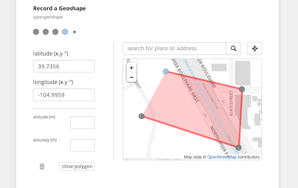

\[edit July 2nd 2014: these widgets have now been further extended with [multiple map layers](/geo-layers)\]

You can now record **geotraces** and **geoshapes** in Enketo Smart Paper. Click the screenshot below to check out a sample form right away.

### Geopoint, Geotrace, and Geoshape

Enketo Smart Paper now supports 3 different geo widgets that work on both mobile devices and desktops: 

1. **geopoint**: to record a single geopoint
2. **geotrace**: to record a line or polyline or multiple geo points
3. **geoshape**: to record a polygon of multiple geo points - the last point is the same as the first point

All geowidgets allow 3 different methods of data entry: **detection**, **manual** input and **map-based** input.

### How to use

Simply use the [new types in your XLSForm](https://docs.google.com/spreadsheet/ccc?key=0Al3Mw5sknZoPdE5Wc0cwTVFnRkxTei1pMzZBZWhnRHc&usp=sharing#gid=0). It is currently supported in Ona and the latest version of [ODK Aggregate](http://opendatakit.org/use/aggregate/). It should be supported in the forthcoming version of [SurveyCTO](https://www.surveycto.com) and [Formhub](https://formhub.org) as well. The widget has been added to the open-source [enketo-core](https://github.com/MartijnR/enketo-core) library which means all tools built around Enketo (core) can make use of it.

### Collaboration

The development of this widget was a great example of [collaboration](https://groups.google.com/forum/#!topic/opendatakit-developers/AfVgKcpE6Jk) between ODK and Enketo. As a result, the new geo-types will work with the ODK tools. For now ODK Collect will show a text input for geotrace and geoshape types, but a proper widget is being developed by a third party. I would like to thank Mitch and the ODK team for their significant contribution by adding the required behind-the-scenes support to JavaRosa, ODK Validate and XLSForm. 

### Sponsorship

The brand new Enketo Smart Paper widget was sponsored by the good folks at [iMMAP](http://immap.org) for use with the iMMAP-developed [twine framework](http://twine.unhcr.org). It's great to see Enketo is becoming more and more the tool of choice for Humanitarian Aid organizations - its key target group! I'll post about some other exciting developments regarding Enketo's continuing adoption by the humanitarian aid community shortly.

### Feedback

As usual, we'd love to get your feedback. Send an [email](mailto:support@enketo.org), tweet [@enketo](https://twitter.com/enketo), post a message in the [Enketo](https://groups.google.com/forum/#!forum/enketo-users), [Formhub](https://groups.google.com/forum/#!forum/formhub-users), [Open Data Kit](https://groups.google.com/forum/#!forum/opendatakit) fora, or comment on this blog post.
