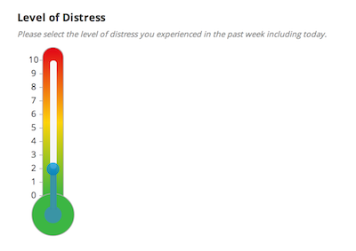
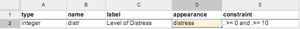

Enketo now has a distress widget, useful for certain kinds of surveys where you'd like to measure stress levels. Try it out in the updated [widgets form](https://widgets.enketo.org/webform).

### How to use

To use the distress widget simply add appearance "distress" to an integer question. The widget works across browsers on both mobile and desktop devices (like all other widgets). It works in both the default theme and the [Grid theme](/gorgeous-grid/).

Though the distress widget only allows input from 0 to 10, it is recommended to add a constraint as well for additional robustness.

The development of this widget was sponsored by [Didymo Designs](http://www.didymodesigns.com.au/) and has been added to the open-source [Enketo Core](https://github.com/MartijnR/enketo-core). This means it is now available to all apps that are built around Enketo Core.

### Influence Enketo!

If you have a need for a particular kind of widget and have a budget for this, we'll be happy to discuss your requirements and give you a quote.


