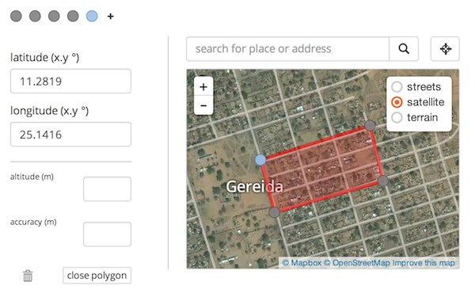
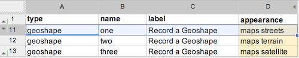

The [new geo widgets](/geo) have been extended to show multiple map layers. You can now switch between streets, terrain and satellite maps. See [this sample form](https://geo.enketo.org/webform).

### How to use

The layer switcher will appear automatically in all Enketo's geo widgets. 

If you'd like to show a particular layer as the _default layer_ when the form loads, simply add the name of the map layer to the appearance column in your XLSForm. 

### Sponsor

This extension to the geo widgets was funded by the [Santa Fe Institute](http://www.santafe.edu) as part of a [collaboration](http://www.santafe.edu/news/item/gates-slums-announce/) between the Santa Fe Institute and [Shack/Slum Dwellers International](http://www.sdinet.org/). 


