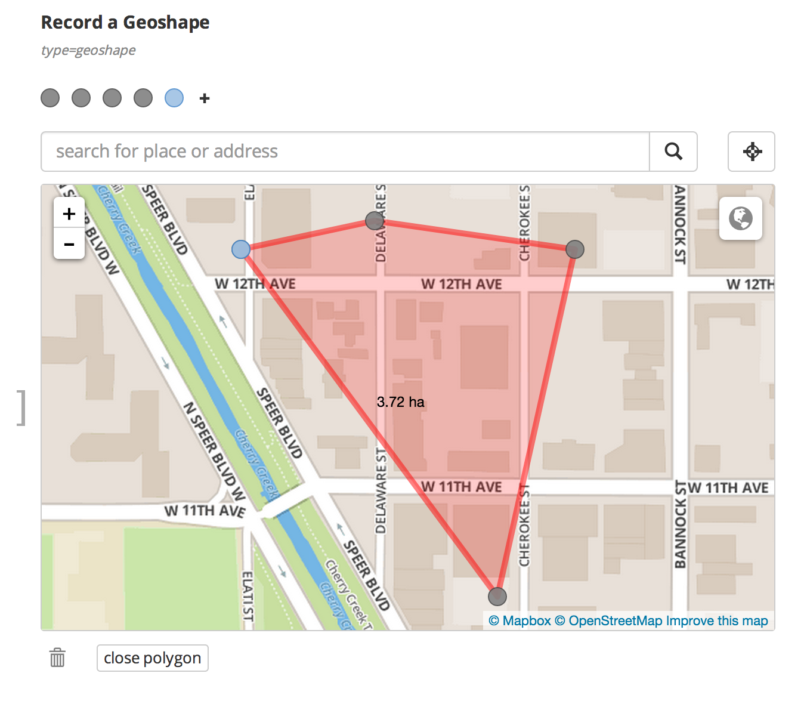
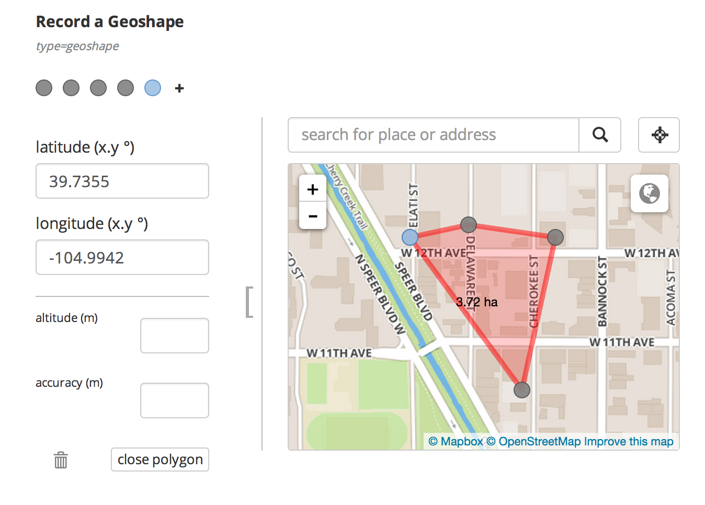

A while back the [geo widgets](/geo) were quietly upgraded to allow hiding of input fields for GPS coordinates and to show a larger map. This is particularly useful when entering data on a desktop by drawing on the map when the input fields take up unnecessary space. You can witch between hiding and showing input fields with the handle on the left of the map border. See [this updated sample form](https://geo.enketo.org/webform).

### How to use

The user can always switch between hiding and showing input fields. By default the input fields are shown when the form loads. To change the default widget view, you can add the appearance _"hide-input"_ to a geo question. 

### Sponsor

This extension to the geo widgets was funded by the [Santa Fe Institute](http://www.santafe.edu) as part of a [collaboration](http://www.santafe.edu/news/item/gates-slums-announce/) between the Santa Fe Institute and [Shack/Slum Dwellers International](http://www.sdinet.org/). 


