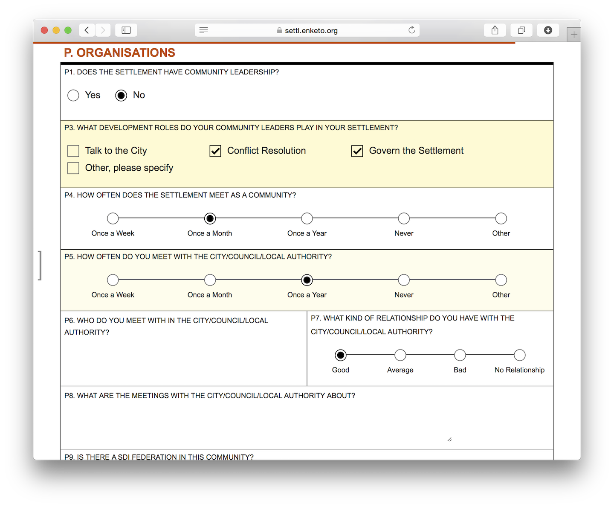

The [Grid Theme](/gorgeous-grid) is now open source! 

### Why?
The Grid Theme had been kept proprietary to give the [paid service](https://accounts.enke.to) a better chance at generating revenue, but this did not sufficiently materialize. Therefore, Enketo is shifting its focus to __development__ without directly providing services\*. To scale the product further (but not the company), we will actively promote the integration of Enketo into existing tools and services - which is already proving to be [quite successful](https://enketo.org/#tools). One way of doing this is by fully embracing open-source. 

With the financing provided by two of my favorite organizations: [iMMAP](http://immap.org) and [HHI (KoBo)](http://kobotoolbox.org), the Grid Theme has now been added to [Enketo Core](https://github.com/enketo/enketo-core). This means it will be available to anybody to use as they please under the terms of terms of the permissive Apache2 license.  

I should mention that the development of the Grid Theme early in 2014 was originally paid for by two other of my favorite organizations and ongoing Enketo sponsors: the [Santa Fe Institute](http://santafe.edu) and [Shack/Slum Dwellers International](http://www.sdinet.org/).  

### Bonus
The old Enketo Smart Paper app (aka [Enketo Legacy](https://github.com/enketo/enketo-legacy)) also had a proprietary module to provide _form authentication_. This module has now become open-source as well and and has been added to the Enketo Legacy repository. Since Enketo Legacy will soon become obsolete, due to the development of a brand new Enketo Smart Paper app, this news is probably less exciting.

### 100% open source
With the release of these last two modules, **every line of Enketo code is now open-source**. There are no plans to develop any new proprietary additions.

 
\* There will be a separate announcement about any changes to the [enketo.org service](https://accounts.enke.to) in due course. Free users should start looking for [an alternative](https://enketo.org/#use) (e.g. self-hosting).
