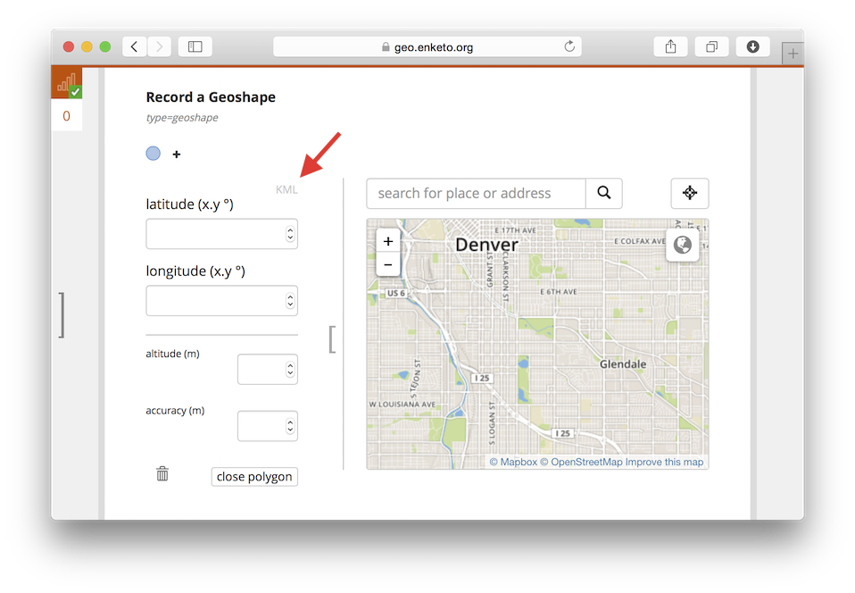
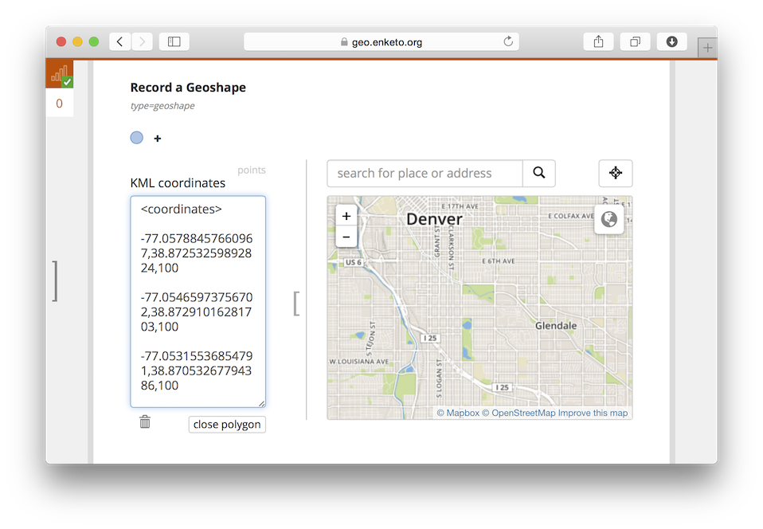
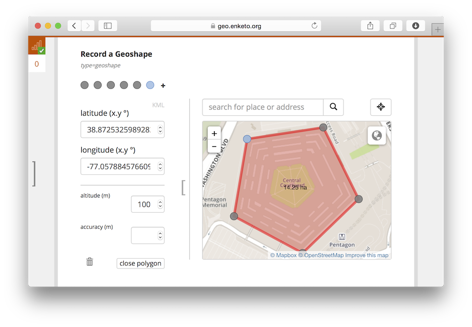

Another update to the Geo Widgets! You can now paste a KML <Polygon\> to record a geoshape. This feature was introduced in December 2014 and is available in all Enketo tools with an up-to-date version of [Enketo Core](https://github.com/enketo/enketo-core). 

### How to Use

The following screenshots show how this feature can be used. Try it yourself by clicking on a picture to load a demo form.

### Sponsor

This extension to the geo widgets was funded by the [Santa Fe Institute](http://www.santafe.edu) as part of a [collaboration](http://www.santafe.edu/news/item/gates-slums-announce/) between the Santa Fe Institute and [Shack/Slum Dwellers International](http://www.sdinet.org/). 


