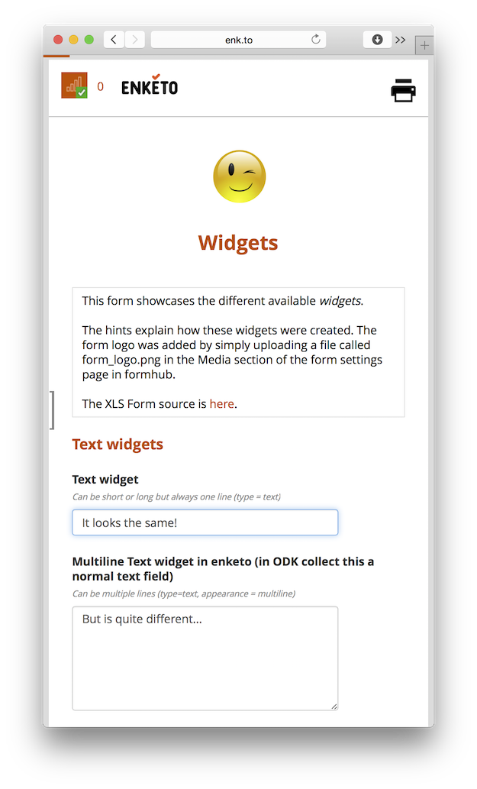

The [new Enketo Smart Paper app](https://github.com/kobotoolbox/enketo-express) (aka _Enketo Express_) is now ready to start replacing the [old Enketo Smart Paper app](https://github.com/enketo/enketo-legacy) (aka _Enketo Legacy_).

### Advantages

For a continuously updated list of differences [see the repository](https://github.com/kobotoolbox/enketo-express#differences-with-enketoenketo-legacy-and-enketoorg). As of today the key advantages of the new app are:

* exactly 10x easier to install
* multi-language user interface
* cross-browser (media) file inputs
* better security of user credentials
* multiple theme support also in form previews
* ability to override default form values via the API
* more advanced form embedding capabilities
* additional authentication option
* form-defined instanceName values are used as the default local record names
* 20x more fun to continue to develop

### Offline Capability Still Experimental

The offline capability was re-developed from the ground up using different storage technologies. Any offline-capable webform views should be considered experimental for the next few months. The online-only views are considered stable. **Please help by reporting bugs [here](https://github.com/kobotoolbox/enketo-express/issues)**

### GitHub Account

It might be confusing that the master repository lives in the [KoBoToolbox GitHub account](https://github.com/kobotoolbox), and a 'fork' exists in the [Enketo GitHub account](https://github.com/enketo). KoBo funded the initial (and still ongoing) development. Without their significant support the new app might have never gotten off the ground. The reason to keep a mirror in Enketo's GitHub account is simply because this the place were some people will start looking first. It is just a mirror, meant to be kept _exactly the same_, so you can use _either one_. Just make sure to 'star' both, if you think they are any good... ;)

### Sponsors

The development of the new Enketo Smart Paper app so far has been funded by [KoBo Toolbox](http://kobotoolbox.org), the [Santa Fe Institute](http://www.santafe.edu), [iMMAP](http://immap.org) and [OpenClinica](http://openclinica.com). For a continuously updated list of sponsors see [the repository](https://github.com/kobotoolbox/enketo-express#funding).


