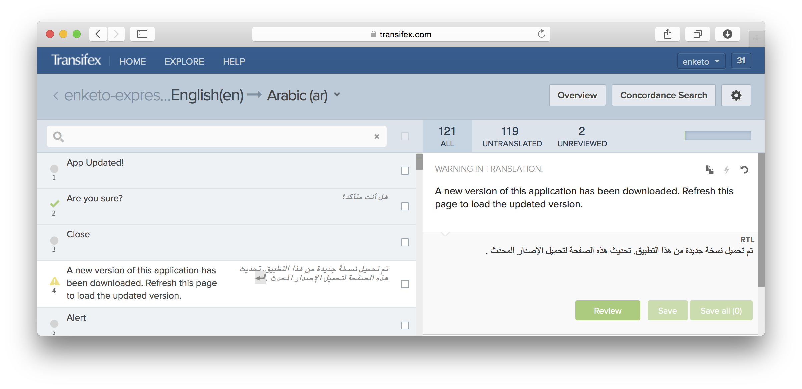

The [new Enketo app](/enketo-express) now boasts a multi-language user interface. The forms themselves have always supported multiple languages but this new feature deals with the interface _around the forms_ (guidance, feedback, error messages).

### Translations Needed!

Currently only Dutch and English languages are included as those happen to be the languages I have some limited ability in. Additional languages can be contributed by **you**! 

We utilize a very user-friendly web interface to translate all of the text strings in Enketo Express. **Any language is welcome**, and in an ideal situation we get 2 persons per language so that one can review. The initial amount of work is only a few hours, while maintaining your translation should only take a few minutes per month. Your contribution will be acknowledged [here](https://github.com/enketo/enketo-express#translation) and you'll be providing **a great service to others** that use this [100% open source project](/now-fully-open-source).

Just send me an [email](mailto:martijn@enketo.org) and I'll sent an invite to get you going!

### Future

Currently right-to-left languages don't display correctly (as right-to-left), but we will endeavour to add that support for the user interface soon after the first right-to-left language translation has been completed.

### Sponsor

The development of this feature was funded by [iMMAP](http://immap.org), because they are awesome.


