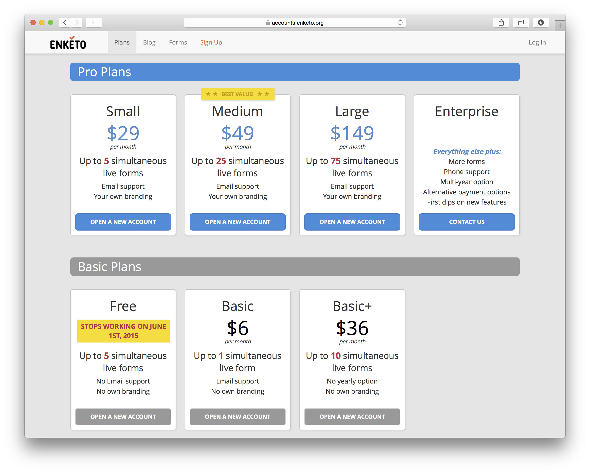

As alluded to [before](/now-fully-open-source), the free enketo.org plans are going to disappear. The timing will coincide with when the [new Enketo app](/enketo-express) is expected to become stable and is now set for the **1st of June 2015**. Current users on the free plan will receive several emails in the next few weeks to remind them to upgrade or to find [another option to use Enketo](https://enketo.org/#use) for their work.

[Edited] To be clear this change only affects users that signed up for a free plan at [accounts.enketo.org](https://accounts.enketo.org). It does **not** affect users of popular sites that offer Enketo as part of their comprehensive service such as [kobotoolbox.org](http://kobotoolbox.org) and [ona.io](https://ona.io).

### Why No More Free?

Free plans served their purpose but frankly have become too popular to keep supporting. They are taking up an ever increasing amount of resources and are eating into valuable development time. The only rationale to continue to provide free plans would have been to provide an option to use Enketo for the very smallest of projects that have no budget at all. However, thankfully, there are now [many good options](https://enketo.org/#tools) that offer Enketo as a service and quite a few are free. 

### Paid Plans

The paid plans will continue. A new "Basic" plan has been added and the "Basic+" has increased in price (starting with the next payment). Existing Basic+ users have received a $17 credit in their accounts to soften the blow.

### The New Enketo App

The [new Enketo app](/enketo-express) will soon jump far ahead of the old app in both features and robustness. ~~~There is no plan yet to migrate the paid enketo.org service to this new app (but it may happen).~~~ [edit: 12/14/2015] The paid service has been updated to use this app. [/edit] The new app is also [much easier to install yourself](https://github.com/enketo/enketo-express#how-to-install-anywhere), so for some paying users that will likely become **a more attractive option**.

### Previews for ODK XLSForm

The free Enketo previews for the OpenDataKit website's [XLSForm convertor](http://opendatakit.org/xiframe/) will continue and have recently been switched over to the new Enketo app.

### Other Scenarios

I think there is an opportunity to turn the service into a sustainable business (1,384 accounts created so far - a far larger market than initially expected). However, it will require some investment and probably a different pricing/feature structure. I currently have no concrete plans to invest more in the service and would be open to discuss proposals of others to take it over.
