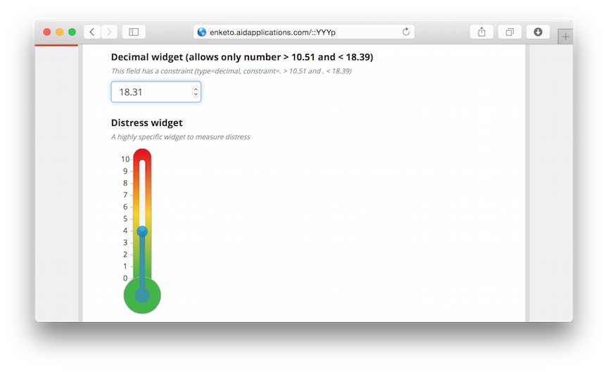
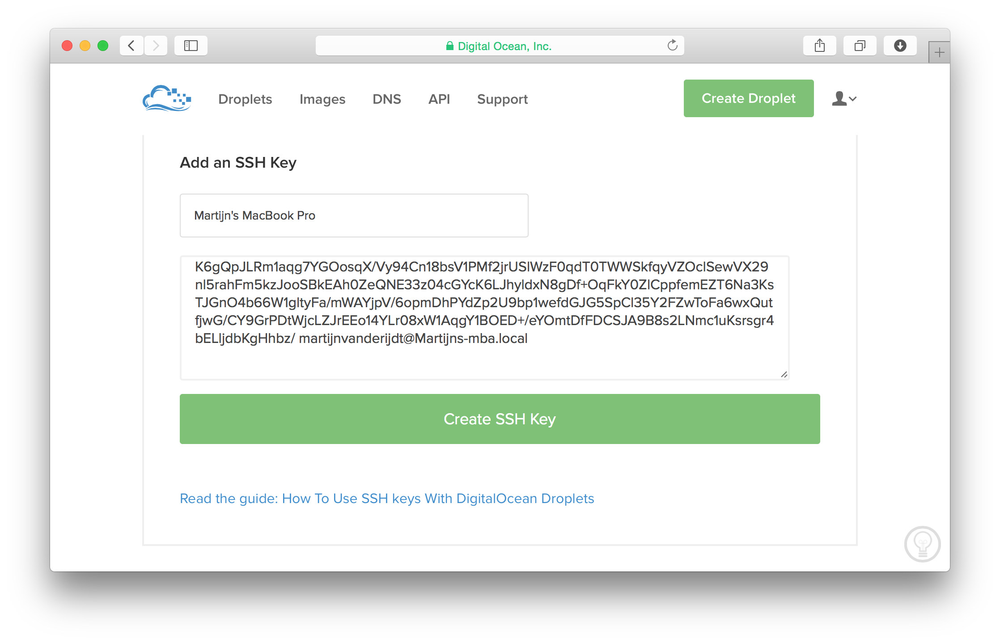
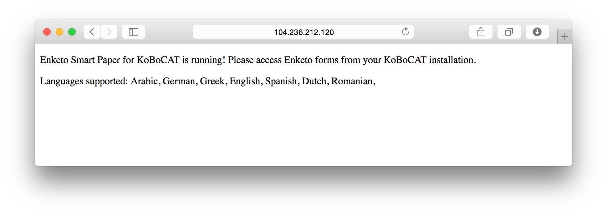
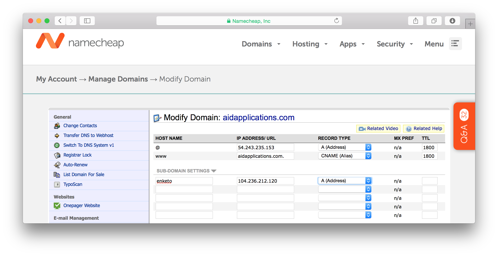
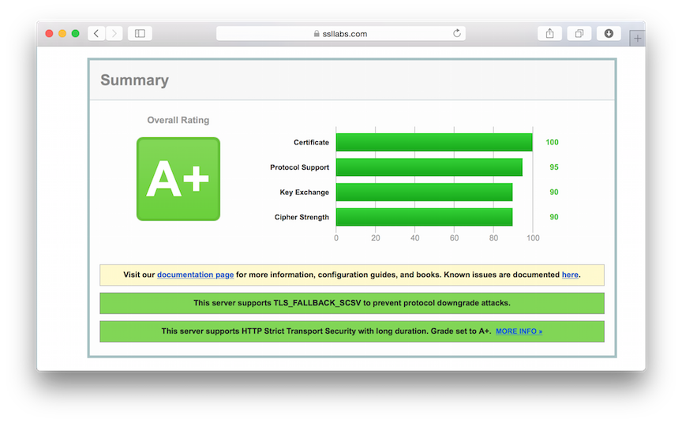
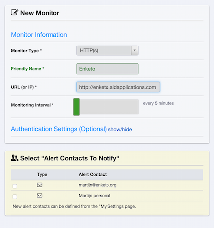

---
title: How To Install Enketo On Ubuntu 18.04
author: Martijn van de Rijdt
layout: post
permalink: /install-enketo-production-ubuntu/
categories:
  - tutorial
tags:
  - enketo
  - ODK Aggregate

--- 

This post describes how to setup a secure _production server_ running Enketo for use with e.g. ODK Aggregate or KoBoCAT on [DigitalOcean](https://m.do.co/c/9e43ccb8961a). It will be updated continuously to use the latest tools and recommended practices. Use the [forum](https://groups.google.com/forum/#!topic/enketo-users/XiTgHFll_nE) to discuss any issues or suggestions for improvement, or if you'd like to expand it with instructions for other hosting providers.



See this [FAQ](https://enketo.org/faq/#troubleshooting-enketo-express) for some common troubleshooting tips.

### 1. Considerations

**Installation is the easy part**. Maintaining a secure and reliable server with close to **0% downtime** - especially when it becomes popular - is a whole lot harder. This document just provides a good starting point to launch a service, but does not help with running, troubleshooting and continuously updating a server and keeping it secure. So before self-installing a production server, be prepared to spend a significant amount of time to run it afterwards.

Self-installation for most people is going to be **far more expensive** than using a public supported service, even if that service is not free. The time required to install and maintain a server and the "cost" of the likely longer periods of downtime will normally outweigh any fee you would pay for a provided service. **If cost is the primary argument to self-install, it is probably not the right decision.** There are of course lots of good other reasons to run your own server!

### 2. Create a public/private key pair 

To authenticate with the server we are going to use a public key, because this is more secure than using (just) a password. Make sure you backup your private and public key combo, so that you do not lose access to your server when your computer breaks down.

If you've already created a public/private key pair for your computer you can skip this step.

#### Windows Users

Install [Window Subsystem for Linux](https://docs.microsoft.com/en-us/windows/wsl/install-win10) and then follow the instructions in this tutorial.

**This is not verified. Please confirm that this tutorial works when using Windows Subsystem for linux and let us know.**

#### All Users

Use the following command in the terminal:

```bash
ssh-keygen -t rsa
```

The location of the keys is _~/.ssh_.

More detailed instructions can be found [here](https://www.digitalocean.com/community/tutorials/how-to-set-up-ssh-keys--2?refcode=9e43ccb8961a) (step 1 and 2 only)

### 3. Create a Server

For this tutorial, we are going to use Ubuntu 18.04 on a DigitalOcean server (aka a _droplet_). DigitalOcean provides the best bang for the buck when looking at CPU speed and CPU cores, both of which are the key criteria for Enketo Express performance. Their user interface is refreshingly well designed too. The tutorial should be quite similar for other VPS providers from section 4 onwards. If you do not have a DigitalOcean account yet, create one using [this referral link](https://m.do.co/c/9e43ccb8961a) to get a $10 credit. 

#### Add your public key to your DigitalOcean account

In the DigitalOcean interface click on _Your Settings_ and go to the [security tab](https://cloud.digitalocean.com/settings/security?refcode=9e43ccb8961a). Click on _Add SSH Key_ and cut-and-paste your **public key** here. Do the same for any other users that will access your server.

[](https://cloud.digitalocean.com/settings/security?refcode=9e43ccb8961a)

Now, whenever you create a new server in DigitalOcean you can add any of these keys with the click of a button and will have immediate secure access via SSH, without a password!

When you buy a new computer you could just move your public and private key pair.

If multiple people/computers have (root) access to the server it is helpful to get the public key from all of them before you create your server, though you can also add them to your server later using a different method.

#### Create a Droplet

Click the [Create Droplet](https://cloud.digitalocean.com/droplets/new?refcode=9e43ccb8961a) button at the top of the screen to create your server.

1. Give it a meaningful hostname, e.g. _enketo-production_
2. Select a size. The cheapest 2 GB option is recommended to start with, and when traffic becomes meaningful you'll probably quickly want to upgrade to a 2 vCPU plan because it has 2 CPU cores. Thankfully, upgrading can be done with the click of a button with only about 2-3 minutes downtime. The storage size is **irrelevant** for Enketo. When you upgrade you will have the (default) option to only upgrade RAM and CPU, or to upgrade storage size as well. It is usually best to choose the first because then you will be able to downgrade again later. **You cannot downgrade to a droplet with less storage than you currently have.** That's also why starting with the cheapest droplet with the least amount of storage provides the maximum flexibility as you'll be able try out different server sizes with little risk and little downtime. And because DigitalOcean bills by the hour, the cost of trying out a different size is minimal too.
3. Select a region that is closest to the geographical center of where your users are located.
4. Select the _Ubuntu 18.04 x64_ image.
5. Click on the SSH key(s) that may be used to access the server.
6. Click _Create_ and wait until this is finished.

**Test**: In your [list of droplets](https://cloud.digitalocean.com/droplets?refcode=9e43ccb8961a) you will now see an IP address that was assigned to your server (e.g. 107.170.165.182). You should now be able to login to this server as _root_. 

Try this out in the terminal with **your assigned IP address** as follows:

```bash
ssh root@107.170.165.182
```

### 4. Server Installation

Login to your server as _root_ via SSH if you haven't done this already. You will probably never need to login as _root_ again after this, because we are going to create a new user now (and will actually block root access during this process).

#### Create a user

In these examples we'll create a user named _enketo_ but you can use any other name. You will be prompted to enter a new password which you will need for configuring and updating your server (ie. for anything requiring `sudo` privileges). **Note: All the terminal snippets below assume you chose _enketo_ as username.**

```bash
adduser enketo
```

To allow this user to login using your private key, we need to copy your public key (already added for root) to your new user account. 

```bash
mkdir /home/enketo/.ssh
sudo chown enketo:enketo /home/enketo/.ssh
cp ~/.ssh/authorized_keys /home/enketo/.ssh
chown enketo:enketo /home/enketo/.ssh/authorized_keys
chmod 600 /home/enketo/.ssh/authorized_keys
```

To give this user sufficient privileges:

```bash
gpasswd -a enketo sudo
```

Configure ssh by disabling root access, and forcing public key authentication:

```bash
nano /etc/ssh/sshd_config
```

Scroll down with your keyboard arrow keys to find the existing settings and change their values to _no_ as mentioned below. Remove the _#_ in front of the sentence if present. These are the correct settings:

```bash
PermitRootLogin no
ChallengeResponseAuthentication no
PasswordAuthentication no
UsePAM no
```

Save your changes with CTRL+X, enter _Y_ to confirm, and then hit Enter

Now restart the SSH service and exit:

```bash
service ssh restart
exit
```

**Test**: You should now be able to login as _enketo_ (instead of _root_) without being asked for a password and have sudo privileges with a password. (You can no longer log in as root.)

```bash
ssh enketo@107.170.165.182
```

#### Install required software

Login via ssh as the user you created previously (**not as _root_**). Install the first batch of software packages as follows and enter _Y_ when asked to confirm:

```bash
sudo apt-get update
sudo apt-get upgrade -y
sudo apt-get autoremove -y
sudo apt-get install -y git nginx htop build-essential redis-server checkinstall python
sudo apt-get install -y gconf-service libasound2 libatk1.0-0 libatk-bridge2.0-0 libc6 libcairo2 libcups2 libdbus-1-3 libexpat1 libfontconfig1 libgcc1 libgconf-2-4 libgdk-pixbuf2.0-0 libglib2.0-0 libgtk-3-0 libnspr4 libpango-1.0-0 libpangocairo-1.0-0 libstdc++6 libx11-6 libx11-xcb1 libxcb1 libxcomposite1 libxcursor1 libxdamage1 libxext6 libxfixes3 libxi6 libxrandr2 libxrender1 libxss1 libxtst6 ca-certificates fonts-liberation libappindicator1 libnss3 lsb-release xdg-utils wget
```

Install Node.js and global Node packages

```bash
curl -fsSL https://deb.nodesource.com/setup_14.x | sudo -E bash -
sudo apt-get install -y nodejs
sudo npm install -g pm2 npm
```

Let Ubuntu automatically install security updates (keep default values and select _Yes_ when asked):

```bash
sudo dpkg-reconfigure -plow unattended-upgrades
```

### 5. Enketo Express Installation

Install Enketo Express and its dependencies. Warnings during the `npm install --production` step can normally be ignored. Errors should not be ignored.

```bash
cd ~
git clone https://github.com/enketo/enketo-express.git
cd enketo-express
npm install --production
```

### 6. Configuration

#### Database configuration

First we stop and remove the default redis service:

```bash
sudo systemctl stop redis
sudo systemctl disable redis
sudo systemctl daemon-reload
```

Then, we configure 2 new redis instances for Enketo that run on different ports:

```
sudo mv /etc/redis/redis.conf /etc/redis/redis-origin.conf
sudo cp ~/enketo-express/setup/redis/conf/redis-enketo-main.conf /etc/redis/
sudo cp ~/enketo-express/setup/redis/conf/redis-enketo-cache.conf /etc/redis/
sudo systemctl enable redis-server@enketo-main.service
sudo systemctl enable redis-server@enketo-cache.service
```

Now, start the 2 Enketo redis instances:

```bash
sudo systemctl start redis-server@enketo-main.service
sudo systemctl start redis-server@enketo-cache.service
```

**Test**: Cache database

```bash
redis-cli -p 6380
ping
exit
```

**Test**: Main database

```bash
redis-cli -p 6379
ping
exit
```

The response to both tests should be: "PONG".

**Note that configuring redis is pretty complex and Enketo's sample configuration is not a one-size-fits-all solution. The size of the enketo-main database plays a big role in how you want to arrange persistence. If enketo-main becomes too big, you'd probably want to switch to using both rdb and aof persistence. Read more [here](http://redis.io/topics/persistence). It is also possible to use a 3rd-party redis service.**

#### Enketo configuration

Create a configuration file by copying the default configuration:

```bash
cp ~/enketo-express/config/default-config.json ~/enketo-express/config/config.json
nano ~/enketo-express/config/config.json
```

The default configuration is almost functional. We just need to create a secret API key and encryption keys. See [this document](https://enketo.github.io/enketo-express/tutorial-10-configure.html) for a detailed explanation of these configuration items. In this example we use a server at https://my-aggregate.appspot.com, but it is easiest to just set the `server url` to `""` for now. So the minimum configuration items to change are:

```json
{
    ...
    "linked form and data server": {
        "name": "My Aggregate",
        "server url": "",
        "api key": "EERTIUCJSHDGKHD234325",
        ...
    },
    "encryption key": "a34sgfj324113413y",
    "less secure encryption key": "b542sdf32dabdery"
    ...
}
```

Use Ctrl-X and enter _Y_ to save the configuration.

Rebuild with the updated configuration:

```bash
cd ~/enketo-express
npm install --production
```

### 7. Automatic Enketo Launch and Restart

Enketo Express should now be functional.

**Test**: Launch Enketo

```bash
npm start
```

In your browser visit the IP address of the server, and add port 8005. E.g. visit http://107.170.165.182:8005. You should see a page similar to the screenshot below.



To make sure Enketo will run automatically upon reboot and will restart itself if it fails, we configure pm2. First stop the server with CTRL-C.

```bash
cd ~/enketo-express
pm2 start app.js -n enketo
pm2 save
sudo pm2 startup ubuntu -u enketo

```

**Test**: Test the API response, using the linked server url and corresponding api key for a non-existing form called _test_, by entering something like the following into a **new terminal window**:

```bash
curl --user EERTIUCJSHDGKHD234325: -d "server_url=https://my-aggregate.appspot.com&form_id=test" http://107.170.165.182:8005/api/v2/survey
```

You should see a JSON response like this:

```json
{
    "url": "http://104.236.212.120:8005/YYYp",
    "code": 201
}
```

**Test**: To verify that Enketo starts automatically when the server reboots, you could reboot the server with:

```bash
sudo shutdown -r now
```

Then wait about 15 seconds and check that Enketo is running by visiting the URL in the browser as in the beginning of this section. Then SSH back into your server.

### 8. Domain setup

#### DNS Settings

If you have rented a domain name for your Enketo installation, we can configure the webserver. In this example we'll be using a subdomain, _enketo.aidapplications.com_, but you can also use the main domain, e.g. _aidapplications.com_.

First create a DNS entry for your domain using the tools that your DNS registrar provides. If you haven't found a DNS registrar yet, you could use [NameCheap](http://www.namecheap.com/?aff=85649). Create an _A record_ that points to your IP address.



#### NGINX Configuration

Create a webserver configuration as follows:

```bash
sudo nano /etc/nginx/sites-available/enketo

```

Use the following initial configuration to test whether the domain and webserver are working. **Make sure that server_name matches an "A"
record you created in DNS and not a CNAME (alias).**

```json
server {
    listen 80;
    server_name enketo.aidapplications.com;
    location / {
        proxy_pass  http://127.0.0.1:8005;
        proxy_redirect off;
        proxy_set_header Host $host;
        proxy_set_header X-Real-IP $remote_addr;
        proxy_set_header X-Forwarded-For $proxy_add_x_forwarded_for ;
        proxy_set_header X-Forwarded-Proto https ;
    }

    client_max_body_size 100M;
 
    add_header Strict-Transport-Security max-age=63072000;
    add_header X-Frame-Options DENY; 
    add_header X-Content-Type-Options nosniff;
}
```

Save the configuration with Ctrl-X and type _Y_. 

Activate the new configuration:

```bash
sudo rm /etc/nginx/sites-enabled/default
sudo ln -s /etc/nginx/sites-available/enketo /etc/nginx/sites-enabled/enketo
sudo service nginx restart
```

**Test**: Go to your (sub)domain in the browser (e.g. http://enketo.aidapplications.com). You should be seeing the front page (if the DNS record has propagated already).


### 9. Install an SSL certificate

Nothing in this section is specific to Enketo. You can also use one of the [thousands of SSL-certificate-installation-tutorials on the web](https://www.google.com/webhp?#q=How+to+install+an+ssl+certificate+for+nginx+on+Ubuntu+16.04).


This tutorial will use free Let's Encrypt certificates using [CertBot](https://certbot.eff.org/). This is a very convenient solution as it can be configured to automatically renew the certificate.

First install CertBot. For NGINX on Ubuntu 18 we follow [these instructions](https://certbot.eff.org/lets-encrypt/ubuntubionic-nginx):
```bash
sudo snap install core; sudo snap refresh core
sudo apt-get remove certbot
sudo snap install --classic certbot
sudo ln -s /snap/bin/certbot /usr/bin/certbot
sudo certbot --nginx
```

**Choose to redirect traffic to HTTPS, and thereby remove HTTP access.**

CertBot will automatically update your NGINX configuration and you may want to tweak it further.

If you are going to iframe Enketo webforms into other web pages, you need to take out the line with `X-Frame-Options DENY` or change it.

Restart the webserver and check if any errors are shown:

```bash
sudo service nginx restart
```

**Test**: Go to [SSLLabs.com](https://www.ssllabs.com/ssltest/) to test your SSL configuration. If all is done correctly you should get an A+.




### 10. Ban Rogue Users

Install fail2ban to reduce the disruption caused by bots continuously trying to break into your server:

```bash
sudo apt-get install -y fail2ban
sudo cp /etc/fail2ban/jail.conf /etc/fail2ban/jail.local
sudo service fail2ban restart
```

You can optionally [further tweak](https://www.digitalocean.com/community/tutorials/how-to-protect-ssh-with-fail2ban-on-ubuntu-12-04?refcode=9e43ccb8961a) fail2ban by editing the configuration (`sudo nano /etc/fail2ban/jail.local`). Make sure to restart the fail2ban service after editing.

### 11. Firewall Setup

The following sets up a firewall:

```bash
sudo apt-get install ufw
sudo ufw allow ssh
sudo ufw allow 80
sudo ufw allow 443
sudo ufw enable
sudo ufw status
```

Type _y_ when asked to proceed with operation.

**Test**: You should now no longer be able to access enketo in your browser using the server's IP address and port.

### 12. Monitoring

A simple and very useful service to monitor uptime is [uptimerobot.com](https://uptimerobot.com). E.g. use a HTTP(s) monitor for https://enketo.aidapplications.com that checks every 5 minutes. Specify how you'd like to be alerted when your Enketo server is unresponsive.



Digital Ocean provides a useful additional monitoring tool, visible in the Digital Ocean droplet interface ("Graphs" tab), which can be installed with:

```bash
curl -sSL https://agent.digitalocean.com/install.sh | sh
```

### 13. Logging

You can log the unique instanceIDs of each successfully submitted record. This can be useful for troubleshooting your form/data server or Enketo.

1. set `log.submission` to `true` in config/config.json
2. create a logrotate.conf file (see sample in setup/config/logrotate.conf, you could cp this to the home directory e.g. and then modify it as required)
3. setup cronjob for logrotate e.g. with `30 2 * * * /usr/sbin/logrotate /home/enketo/logrotate.conf -s /home/enketo/enketo-express/logs/logrotate`

### 14. Final configuration

Once, your Enketo server and its integration with the form server is working, go through each item in [this document](https://enketo.github.io/enketo-express/tutorial-10-configure.html) to further configure your Enketo installation. Start by setting the `server url` to its proper value and see if the integration still works afterwards. Make sure to rebuild with `grunt` and `pm2 restart enketo` after updating your configuration.

### 15. Link Enketo server with the Form & Data Server

Please see the instructions for the Form & Data server you are using. The 2 key values needed to link Enketo are:

1. The API key you set in step 6 of this tutorial in Enketo's config.json. Do not keep the default value!
2. The API URL. This is the domain your Enketo is available on + /api/v2 or /api/v1, e.g. https://enketo.aidapplications.com/api/v2. Due to the limited integration in ODK Aggregate those users may prefer to use /api/v1 if offline-capable webforms are desired. Ona and KoBoToolbox have very comprehensive Enketo integration (including previews, offline, online-only, single-submission etc) and should therefore use the full-featured /api/v2. ODK Central integration [is forthcoming](https://forum.opendatakit.org/t/integration-of-enketo-into-odk-central/13992) and will use /api/v2.

### 16. Backups (and restore or move database from another server)

Only **two files** contain critical information that **absolutely** should be backed up: the main database and the Enketo configuration file. 

The database file is located at _/var/lib/redis/enketo-main.rdb_. Restoring can be done simply by stopping redis (`sudo systemctl stop redis-server@enketo-main.service`), copying the backup file, and starting redis (`sudo systemctl start redis-server@enketo-main.service`). (Tip: use `scp` to copy a file from your computer to the new server).

To get access to the redis files, it is helpful to add the _enketo_ user to the _redis_ group:

```bash
sudo usermod -a -G redis enketo
```

The configuration file is located at _~/enketo-express/config/config.json_. Restore this file by copying it and restarting Enketo.

Other files to perhaps consider backing up: logs (if enabled), NGINX configuration, custom scripts, other app configuration files, and the letsencrypt configuration.

### 17. Update Enketo to the latest version

The following commands can be used to update Enketo to the latest version:

```bash
cd enketo-express
git pull && npm install --production && pm2 restart enketo
```

You may have to remove the file _package-lock.json_ first.
