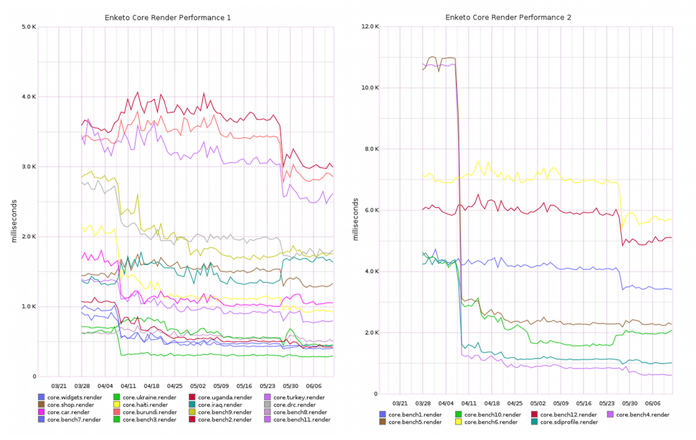
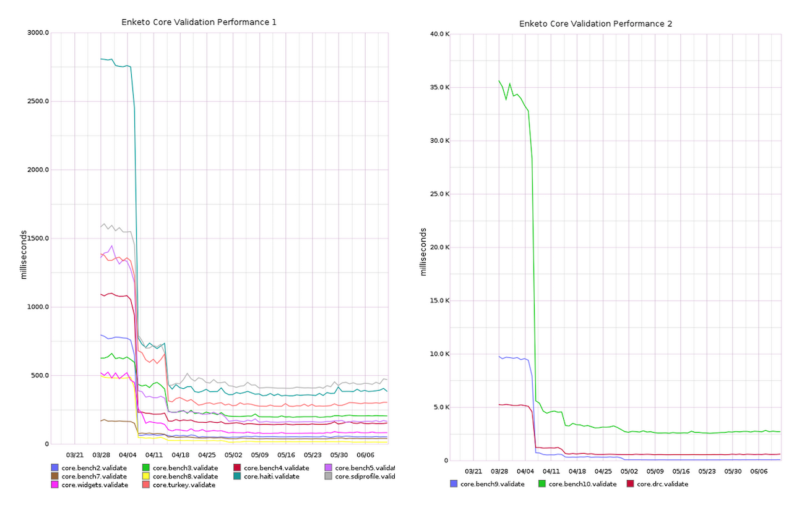

---
title: Performance Boost
author: Martijn van de Rijdt
layout: post
permalink: /performance-boost
categories:
  - Uncategorized
tags:
  - enketo
--- 

The performance of Enketo's form engine has improved drastically in the past few months. 

 
&copy; <a href="https://www.flickr.com/photos/jurvetson/271826059">Steve Jurvetson</a> (unmodified), <a href="https://creativecommons.org/licenses/by/2.0/">CC</a>

This large improvement project was funded by the [Santa Fe Institute](http://www.santafe.edu) as part of a [collaboration](http://www.santafe.edu/news/item/gates-slums-announce/) between the Santa Fe Institute and [Shack/Slum Dwellers International](http://www.sdinet.org/). The project is now complete and this blog post documents the improvements that were introduced in the period between the 1st of March and the 1st of June 2015.

### Monitoring Metrics

A [new application](https://github.com/enketo/enketo-core-performance-monitor) was developed that is hosted on its own stable server and automatically runs a set of performance measurements every hour. It always uses the latest version of [Enketo's form engine](https://github.com/enketo/enketo-core). It runs these measurements on a collection of 25 challenging XForms that provides a good cross-section of all the different performance bottlenecks that can be created with our form format (e.g. creating a form with 100 default repeats or with 2,000 questions).

The development of this application had two objectives:

1. measure the impact of part of this 4-month performance-boosting project, and
2. continuously monitor the performance in the future

The second objective allows us to see which future features, fixes, and changes will result in an increase or decrease in performance. Any spike in the automatically-updated graphs can be easily linked to specific changes in the code. This will prove to be an invaluable tool to have at our disposal.

### Loading Performance

Initial loading performance was a particular focus in this project. The graph below shows the results of this work. Each line represents a different form in the collection of 25 forms.

The loading performance was improved across the board. Two extreme cases ("bench4" and "bench5" forms) now load 16 and 5 times faster, respectively, than they did 4 months ago.

### Validation Performance

Validation performance became another area of intensive focus when a profiling exercise showed a suspicious sluggishness, in particular for forms that contained a large number of _select one_ and _select multiple_ questions. This metric describes the time it takes from clicking the validate or submit button to either getting negative validation feedback or clearing the way to proceed with saving and submitting.

The graphs clearly show the incredible performance improvements that were achieved across the board.

### Responsiveness on Mobile

Another opportunity for improvement that was investigated in great detail was a noticeable lag between clicking a question option and showing that option as selected on a mobile device. A similar lag was present between clicking a text or number input field and the appearance of a keyboard.

The cause of this lag was identified and eliminated. As a result the click response became around 4 times faster on the problematic test form used for development. It was not possible to include this metric in the performance monitoring application.

### External Data Loading

External data is already supported in Enketo Express, though so far can only be used by Aggregate users that are willing to make manual tweaks to their XForms (i.e. virtually nobody). It will be elaborated on in a future post when [this XLSForm feature](https://github.com/XLSForm/pyxform/issues/30) is implemented and the feature becomes available to a wider audience.

The performance of loading external data was improved under this project. It was not feasible to include this metric in the performance monitoring application.

### Indexed-repeat Function

Support for the indexed-repeat function has long been conspicuously absent from Enketo. It was developed before but was never activated because it resulted in a significant performance hit. Under this project, the performance degradation was largely resolved, and the function is now finally supported.

### Future Performance Improvements

I think that we are now very close to the end of what we can improve performance-wise with the current architecture. To improve Enketo's form engine performance further in the future, we will have to switch to using a non-DOM dependent framework or library. [ReactJS](https://facebook.github.io/react/) is the most interesting option at the moment.

If you have a form that still seems particularly slow, it would be great to add it to our benchmark. Please send it. You'll be able to track improvements over time on the [realtime-updated graphs](https://github.com/enketo/enketo-core-performance-monitor/blob/master/README.md).

