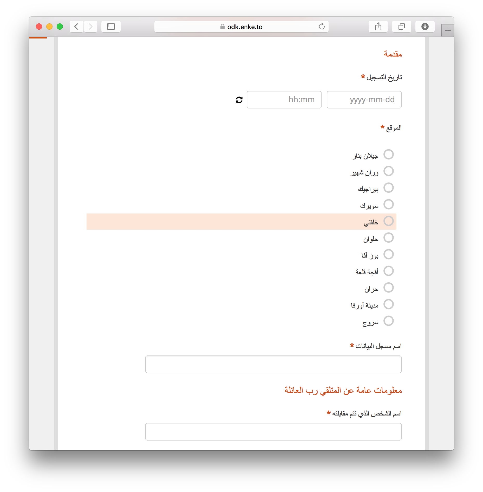
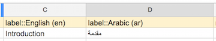

---
title: Full Right-to-left Language Support
author: Martijn van de Rijdt
layout: post
permalink: /advanced-language/
categories:
  - Uncategorized
tags:
  - enketo
--- 

The [new Enketo](/enketo-express) is now able to display languages from right-to-left.

### UI vs form language

It is important to clarify that there are two different language environments in both Enketo and ODK Collect:

1. **Forms** have their own built-in translations of questions, hints, and options. 
2. The **User Interface** (UI) is a separate environment and has independent multi-language support with translations [provided by volunteers](https://www.transifex.com/enketo/enketo-express).

When required, Enketo will now display languages from right-to-left **in both the UI and the forms**.

### Tip: Prepare for the Future

Though not required, it is highly recommended to slightly change the language tags used in XLSForm, adding the language code in parenthesis after the language name. E.g. instead of "label::Français", use **"label::Français (fr)"**. 

The reason for following this syntax is to enable a **future feature** that will match the UI language with the current form language. So implementing these tweaked language tags will make your forms ready for the future.

The language codes (called _subtags_) for all languages can be found [here](http://www.iana.org/assignments/language-subtag-registry/language-subtag-registry) (just do a search with Ctrl-F or Cmd-F).

### Sponsor

This right-to-left language support was fully funded by [KoboToolbox](http://kobotoolbox.org), an incredible system to manage information in humanitarian crises by the [Harvard Humanitarian Initiative](http://hhi.harvard.edu/) and UN OCHA.


