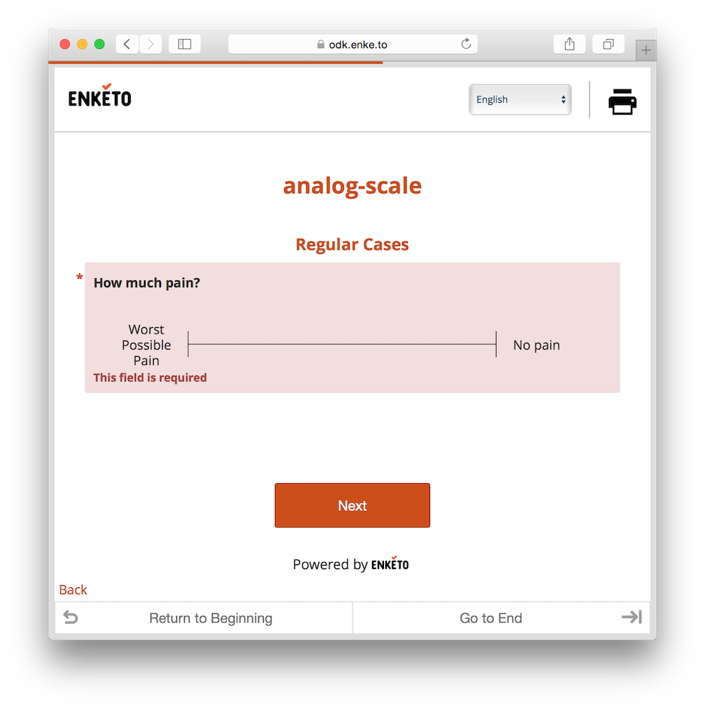

Enketo's [pages mode](/pages) now requires the current page to be valid before the user is able to proceed to the next page. This means any required questions need to be answered and any constraints need to be met. The behavior is now in line with ODK Collect.

Now that Enketo's [paid service](https://accounts.enketo.org) and [Ona](https://ona.io/) have switched to the new Enketo application, and others will soon follow, we'll stop referring to the _old_ and _new_ Enketo. From now onwards, every bit of news is always about the new Enketo.

### Acknowledgements

This feature was largely contributed by [Medic Mobile](http://medicmobile.org/), the first major external code contributor to Enketo Core! Additional support from [KoBoToolbox](http://kobotoolbox.org) made it possible to expose this feature in the Enketo web application.


We still have some [ideas](https://github.com/enketo/enketo-core/issues/326) about how to further change the UI in pages mode. Don't hesitate to add yours.
