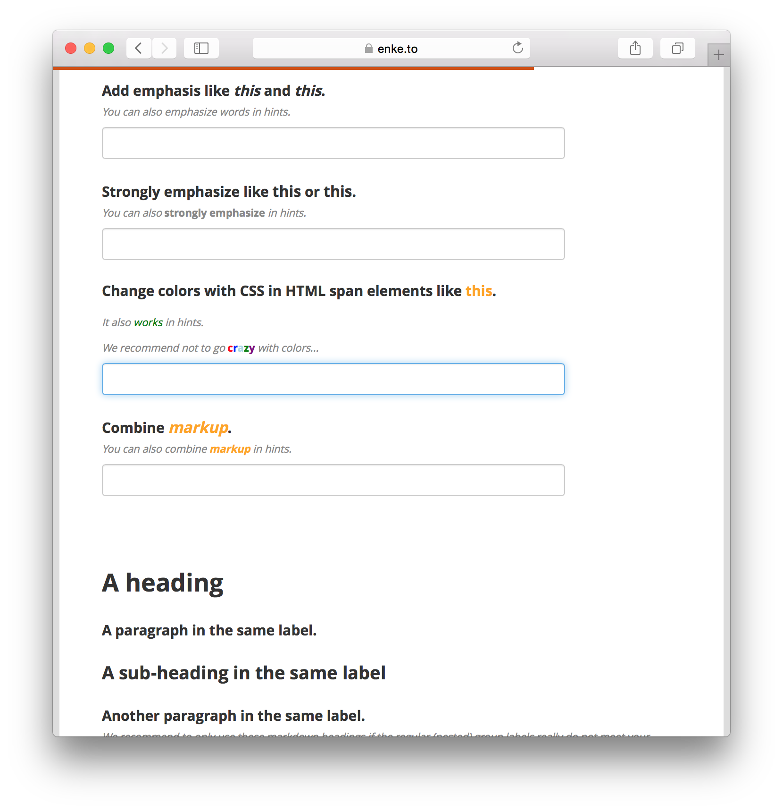

Text formatting was [previously](/better-notes) only supported in notes but has now been extended across labels and hints for **all question types**. We've also added support for changing text colors with HTML <span\> elements and css, as well as support for headings. 

### How to Use

To format text in Enketo (and I believe soon in ODK Collect too), use the Markdown syntax, as follows:

---

[links](https://enke.to/::markdown)

`[links](https://enke.to/::markdown)`

---

new 

lines

---

*emphasize* 

`*emphasize*` or `_emphasize_`

---

**strongly emphasize**

`**strongly emphasize**` or `__strongly emphasize__`

---

colors 

`colors`

--- 

#### headings 
`#### headings`

---

### Acknowledgements

This feature was sponsored by [OpenClinica](https://www.openclinica.com), a top-notch company that has [enthusiastically adopted Enketo](http://blog.openclinica.com/2015/03/19/engineering-openclinicas-future/) and is actively pushing it forward.


