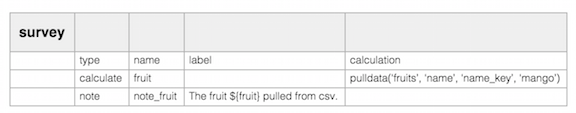

Enketo now supports the pulldata() function. Yes, it's true, we squashed yet another incompatibility with ODK Collect! This one actually took some creativity. See the table on [this page](https://enketo.org/openrosa) for remaining differences with ODK Collect.

### How to Use

See [xlsform.org](http://xlsform.org/#how-to-pull-data-from-csv) for guidance on how to use this function. Note that this requires an **up-to-date version of the XLSForm convertor** due to a small-but-important XForm syntax change. The convertor that is integrated into [Ona.io](https://ona.io) is up-to-date. Older forms may have to be re-uploaded.

The convertor at [opendatakit.org](http://opendatakit.org/xiframe) and Nafundi's [XLSForm offline](https://gumroad.com/l/xlsform-offline) desktop application have **not yet been updated** with this change at the time of writing. 

### Acknowledgements

This feature was made possible by the good people at [Ona](http://ona.io/). Ona funded Enketo's development work for this feature and added the required change to the XLSForm convertor.


