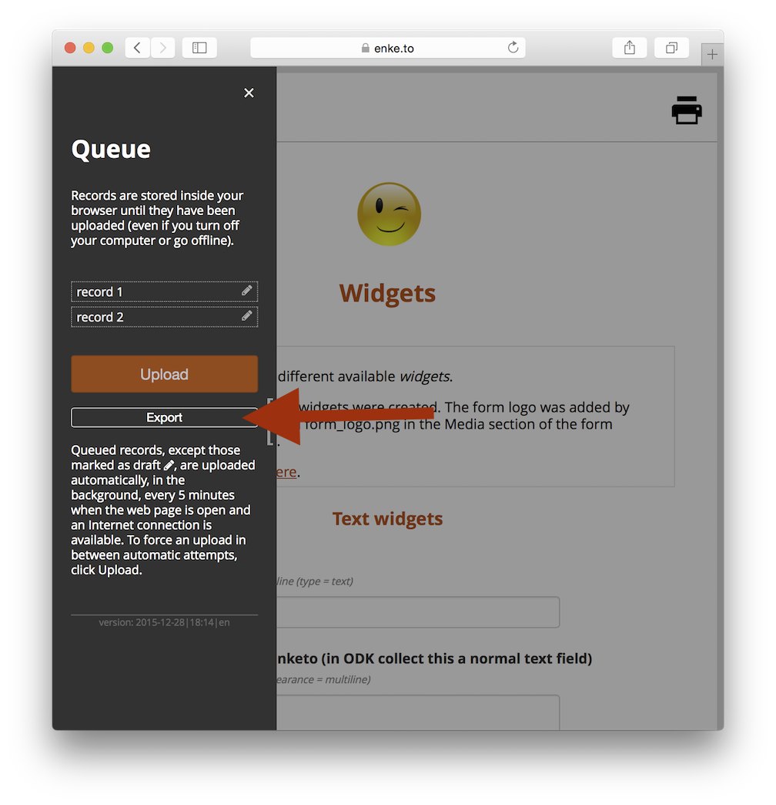

Enketo now provides a way to create **useful** export files of unsubmitted records. This works across browsers, even on mobile devices. The most exciting part of this feature is that it creates a zip file that uses the same file and folder naming conventions as ODK Collect. It also includes media files.

### Why Use This

This feature is meant to serve as a backup to provide additional data security. We recommend regularly creating an export file during long offline periods and/or accumulating important draft records.

Note that export files do not include _already submitted records_ since those are removed from Enketo immediately after they are **successfully** submitted.

### How to Use

Click export in the records queue for the form you'd like to export unsubmitted records of.

If you need to import these exported records, because data was lost, it is best to contact your provider (i.e. where your data goes) for advice on how best to do this. There may be different options, all outside of Enketo. It is the same procedure that can be used to manually copy data out of ODK Collect.

### Acknowledgements

This feature was sponsored by one of Enketo's top sponsors: [KoboToolbox](http://kobotoolbox.org/), the leading solution for information management in humanitarian aid.


