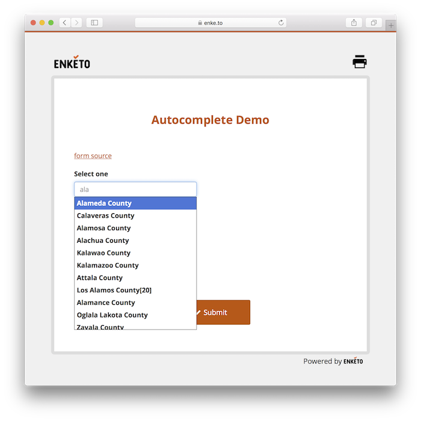
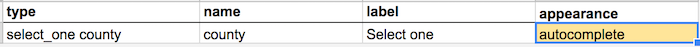

Enketo added support for autocomplete widgets at the beginning of March 2017.

This widget turns a regular "select one" question into a search box. It's very useful for long lists. Click the form below for a demo.

### How to Use

Simple add appearance "autocomplete" to a "select one" question. That's all.

Note that appearance "search" is an alias and is exactly the same.

### Acknowledgements

This feature was made possible by funding from the [Survey123 team at Esri](https://survey123.arcgis.com/). Many thanks to them for supporting the Enketo project and pushing it forward.


