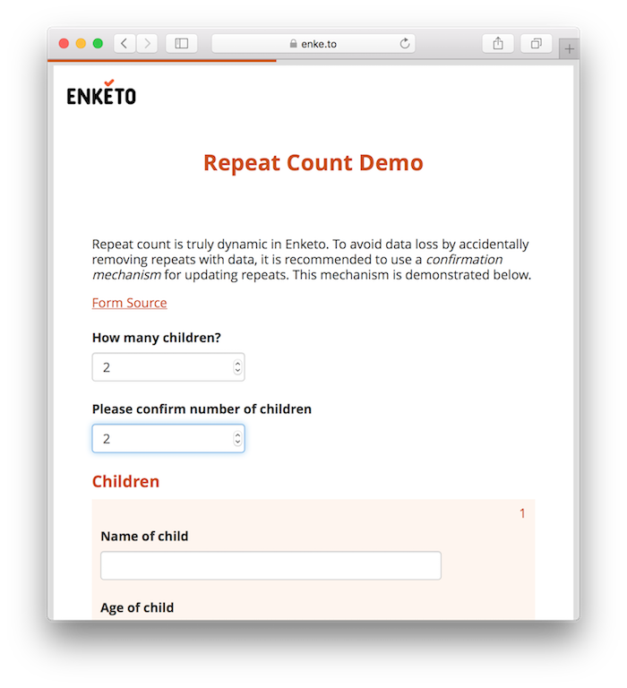

We have made some often-requested improvements to how "repeats" behave in Enketo.

### Repeat Count 

The existing "Repeat Count" feature has now become fully dynamic. This means that if at any point the repeat count changes, the number of repeats will automatically be adjusted.

To avoid accidentally removing repeats that contain data, we recommend using an advanced form-building technique that requires a confirmation. You can see this technique in action by clicking the image below. See also the [XLSForm](https://docs.google.com/spreadsheets/d/132dvmd73Y4fBQbv9cZs1JrDcY3C0y2dt2_IkMMuFJQc/edit?usp=sharing). Using this confirmation technique is completely optional though.

### First Repeat in Series

Enketo is now supporting the removal of the first repeat in a series as well. At this moment, a repeat count of 0 (or none) will remove all repeats. ~~We are currently [discussing](https://github.com/enketo/enketo-core/issues/402) enabling the manual removal of the first repeat when no repeat count is used.~~ Update: since October 16th, 2017, the first repeat can also be manually removed if repeat count is not used (again thanks to Esri funding).

### Acknowledgements

This feature was made possible by funding from the amazing people at [Esri](http://www.esri.com/).


