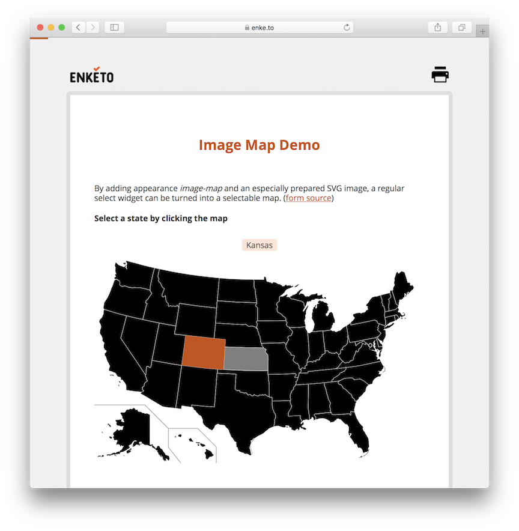
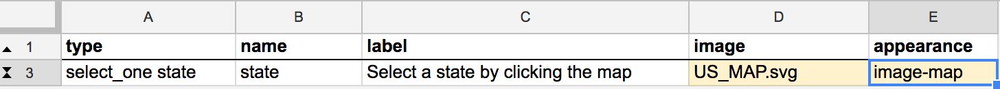
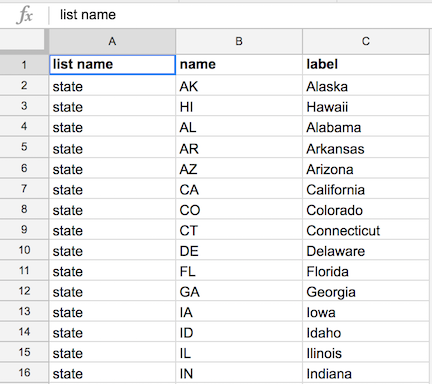
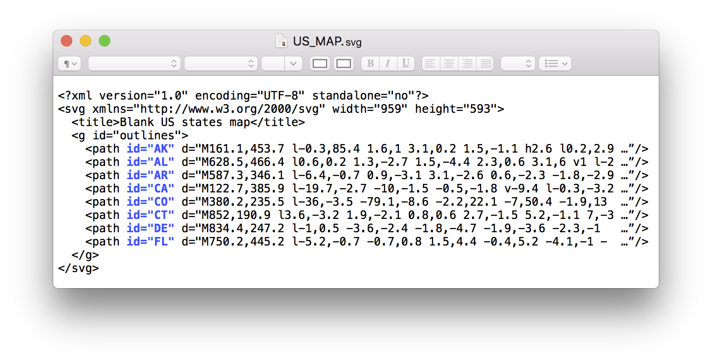

There is very exciting new select widget in Enketo that can be used to select a region from an SVG image. Click the demo below.

### How to use

The XLSForm syntax for this widget is very simple. Add an SVG image and the appearance "image-map" to any regular select or select_one widget.

The next step gets a little more involved as we need to link the values of the choices (i.e. the "name" column in XLSForm) to correspond with the "id" attributes on the paths or groups in the SVG document. A particular id can only be used on 1 element in the SVG document. The easiest is probably to create a regular choice list in XLSForm first and then edit the SVG file _in a text editor_ (SVG is just text).

As far as we know, any SVG image could be used to make certain "paths" (`<path>`) or "groups" (`<g>`) clickable, but there may very well be surprises for some complex images.

### Acknowledgements

This feature was made possible by funding from [KoboToolbox](https://kobotoolbox.org/) under their project with WFP. Many thanks to them!



