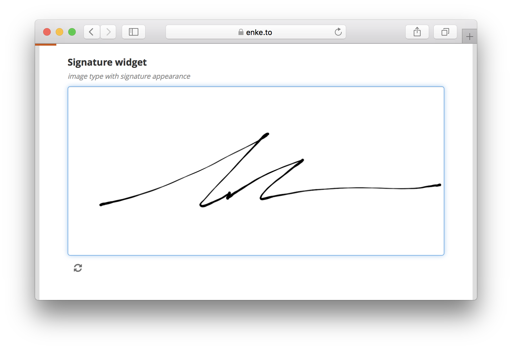
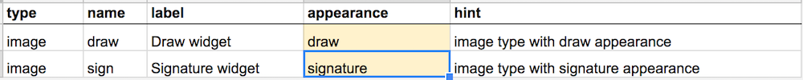

On the heels of the amazing new [Image-map](./image-map) widget, I have the pleasure of announcing the completion of the often-requested **Signature** widget. Adding to all the excitement, a **Draw** widget is now also available to further improve compatibility of the tools in the ODK ecosystem. Click the image below to test the new widgets right away.

### How to use

In your XLSForm just add "signature" or "draw" under the appearance column for an image-type question.

### Acknowledgements

This feature was made possible by funding from [OpenClinica](https://www.openclinica.com/) as part of their ongoing Enketo Support Operations. Many thanks!



